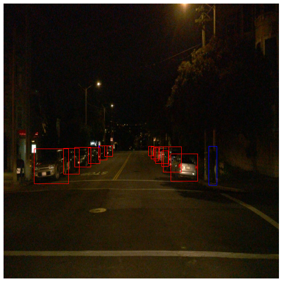
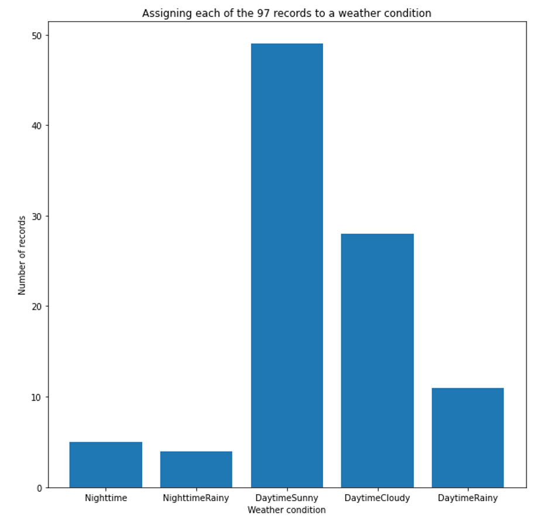
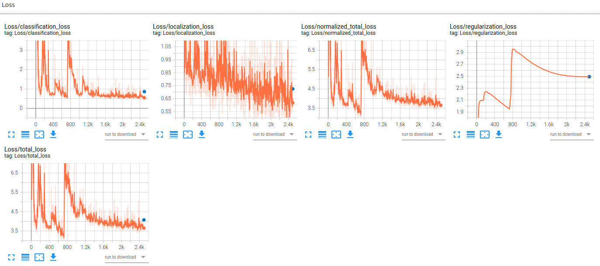
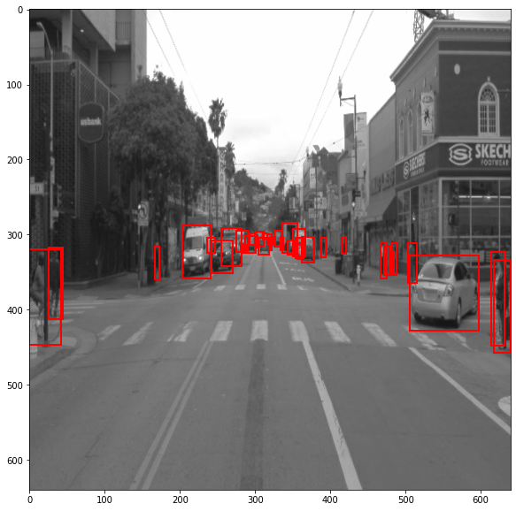

# Project overview
A reliable object detection and classification is the basis for all self-driving vehicles. If we achieve this first step, wen can build more advanced algorithms for object tracking, prediction of object trajectories and also plan the trajectory of the ego vehicle on top.  
The overall goal of this project is to train a CNN based on a Single Shot Detector (SSD) Resnet 50 640x640 model. The model is trained with data from the [Waymo Open Dataset](https://waymo.com/open/), to detect vehicles, pedestrians and cyclists.  


# Set up
In my case the classroom workspace provided by Udacity was used.
## Folder/File Structure:  
* After the split training data is stored under /home/workspace/data/waymo/
    - **train:** containinng the training data
    - **val:** containinng the validation data
    - **test:** containinng 3 files to test the model
* The experiments folder is organized as follow:
experiments/
    - **pretrained_model/** - contains the ssd_resnet50_v1_fpn_640x640_coco17_tpu-8 model which can be downloaded [here](http://download.tensorflow.org/models/object_detection/tf2/20200711/ssd_resnet50_v1_fpn_640x640_coco17_tpu-8.tar.gz)
    - **exporter_main_v2.py** - to create an inference model
    - **model_main_tf2.py** - to launch training
    - **reference/** - reference training with the unchanged config file
    - **experiment0/** - result of the first experiment
    - **experiment1/** - result of the first experiment
    - **experiment2/** - result of the first experiment
    - **label_map.pbtxt**
* Training_WeatherConditions.json: JSON file which assigns each tfrecord of the subfolder /home/workspace/data/waymo/training_and_validation to a selection of weather conditions. This file was created manually, as described in the Dataset Analysis section.  

## Execution
1. Execute a splitting of the dataset, either by doing a random split with `split()` or using the function `weather_based_split()` both of which are located in the file create_split.py. Curently the default split is done with the function `weather_based_split()`.  
2. Run the training by executing the following commands:  
* **Training process:**
```
python experiments/model_main_tf2.py --model_dir=experiments/reference/ --pipeline_config_path=experiments/reference/pipeline_new.config
```
Once the training is finished, launch the evaluation process:
* **Evaluation process:**   
```
python experiments/model_main_tf2.py --model_dir=experiments/reference/ --pipeline_config_path=experiments/reference/pipeline_new.config --checkpoint_dir=experiments/reference/
```

>This section should contain a brief description of the steps to follow to run the code for this repository.


# Dataset
Before starting any training run the [Waymo Open Dataset](https://waymo.com/open/) is inspected. 
## Dataset Analysis
In the Udacity workspace we have 97 .tfrecord files each containing 20 images. Through the get_dataset() call of `utils.py` we read indefinitely from the tfrecords.    
In order to analyse the dataset we use `Exploratory Data Analysis` notebook to randomly display images and their corresponding bouding boxes and labels, as shown in the exmaple below:

Cars are denoted by red bounding boxes, pedestrians by blue ones and cyclists by green ones.  
Through the analysis we see that the number of objects per image have a great variance, i.e., in some images there are no objects and in others the image is densely spotted with vehicles, pedestrians and cyclists (over 60), some of which partially hidden.  
Furthermore most of the pictures where taken during daytime and there exist not many where the light or weather condition is bad. The following plot shows a classification of tfrecords to weather condition. As can be seen the largest portion can be assigned to "good" weather conditions, where the camera has a free view with good lightning conditions.  

The figure showing the weather distribution of the records was created manually by visualizing one image of each tfrecord file. But since each record contains an image sequence, it is acceptable to classify a record based on one image alone. The code for the visualization of one image can be found in the `Exploratory Data Analysis.ipynb` notebook. The above plot is created in `Data_Visualization.py`.  
The following graph shows how many objects are on average in a single image of each tfrecord. As can be seen, most of the detected objects where cars, then pedestrians and only very few bycicles. The code for the data acquisition can be found in the `Exploratory Data Analysis.ipynb` notebook. 

Maybe we need to somehow compensate for these two imbalances during training. The relatively small number of images with bad light conditions can be taken care of through data augmentations, but the fact that there are only very few images containing cyclists is harder to overcome.    
At last one can see that the images are taken from multiple image sequences, because the same obejcts can be found in several images.  

## Cross validation
As I undersand it we should only move the complete files and do not need to split single .tfrecords and rearrange them in new mixed records.  
My appraoch is to split the files based on the weather condition. That is, I randomly choose a specified percentage from each weather condition and move the files to the train or validation folder.  
Since there are already three tfrecords in the test folder I completely omit creating a test set.     

This section should detail the cross validation strategy and justify your approach.


# Training
## Reference experiment
The following plots show the performance behaviour of the reference model with predefined weights and config for 2500 optimization steps. The orange curve denotes the training process and the blue dots correspond to the evaluation after training:  

Due to the limited GPU power it was only possible to run a evaluation or a training process, but not both in parallel, even when the batch size is reduced to 1. Therefore, above plots only show the evaluation for the trained model, that is, one blue dot after 2500 optimization steps.  
From this initial run we see the following two points:
* The learning rate in the beginning is too large for the loss function has some large increases during the first 900 steps
* The model is overfitting a little bit since the evaluation loss is approximately 0.5 points above the trainig loss
Theese two shortcomings are addressed in the next section. 
## Improve on the reference
Starting from the reference experiment some modifications were tested in order to improve on the model performance. Since our dataset is small the first steps are to augment the data by the following methods:
* Random grayscale conversion with probability of 0.01
* Random brightness adjustment with max_delta 0.3
* Random contrast adjustment with values between 0.6 and 1.0

Through this the small dataset can be extended and the model is for example confronted with grayscale images as shown below:


Furthermore, the learning rate is reduced and defined by the following parameters:
* learning_rate_base: 0.0004
* total_steps: 2500
* warmup_learning_rate: 0.0001
* warmup_steps: 200

Another parameter that was adapted is the batch size, which was doubled to 4. The reason is that during experimenting I encountered many jumps in the loss curve and as described in the last section this can be reduced by the batch size value.  
As a result the following performance was achieved:  
Loss:

Precision:

Recall:

As with the reference model it was not possible to run evaluation and training in parallel, therefore only a single evaluation run was executed after the training process.  
By taking the steps described above we decreased the total loss and also managed to reduce the overfitting. But in my opinion one problem still remains: The imbalance of the dataset. One the one hand the images contain only very few cyclists and on the other hand I believe the images taken during bad lightning or weahter conditions are too few. Wthin limits the last point can be reduced by extensive augmentations, they do not provide the solution for the lack of cyclists.  

### Fluctuation
For the fluctuation of the training loss which I encountered during the experiments I have two possible explanations:  
* By using a very small batch_size of 1 or 2, we are doing gradient steps based on small input data. Thus, an update based on unbalanced input can lead to an increase of the global loss, i.e., we take a step away from the local minimum. When the batch_size is larger, such effects should have a smaller impact, since an update is based on more and hopefully more balanced data.
* Another explanation may be the learning rate which can be chosen too large and therefore we are jumping around the local minimum but not able to get significantly closer. 
